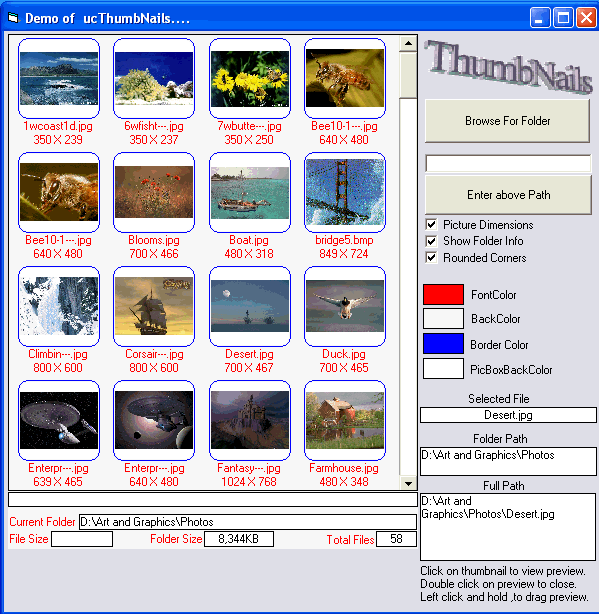



## Thumbnails\_Usercontrol

### Description

This is a drop-in thumbnails usercontrol. Its finally working the way I wanted. Hope you can find it useful. If you can make any improvements, please let me know .Thanks
 
### More Info
 

             |
---                |---
**Submitted On**   |2008-02-15 08:13:00
**By**             |[Kenneth Foster](https://github.com/Planet-Source-Code/PSCIndex/blob/master/ByAuthor/kenneth-foster.md)
**Level**          |Intermediate
**User Rating**    |4.8 (48 globes from 10 users)
**Compatibility**  |VB 6\.0
**Category**       |[Custom Controls/ Forms/  Menus](https://github.com/Planet-Source-Code/PSCIndex/blob/master/ByCategory/custom-controls-forms-menus__1-4.md)
**World**          |[Visual Basic](https://github.com/Planet-Source-Code/PSCIndex/blob/master/ByWorld/visual-basic.md)
**Archive File**   |[Thumbnails2102052162008\.zip](https://github.com/Planet-Source-Code/kenneth-foster-thumbnails-usercontrol__1-70104/archive/master.zip)

